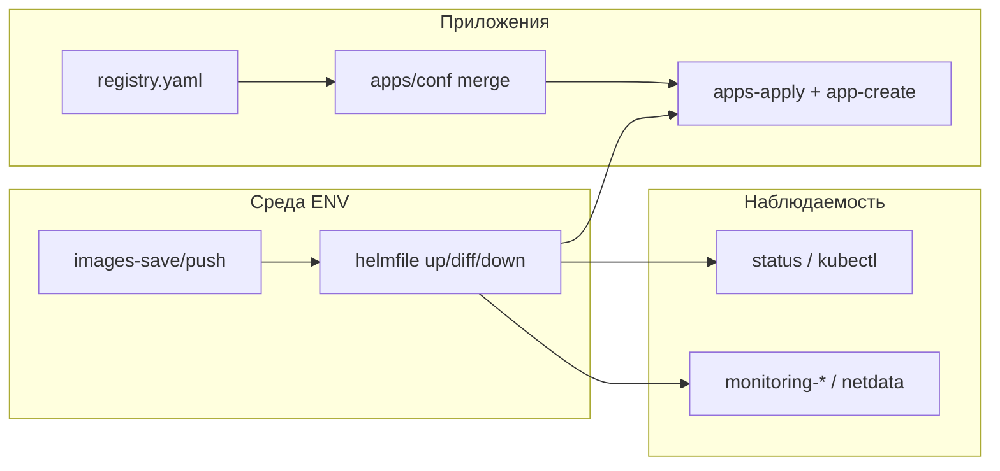

# Сценарии использования infra: local/prod и приложения

Описательные потоки для того, кто владеет кластером (microk8s), поднимает data-сервисы и выдаёт приложениям изолированные учётки. Длинные списки команд не дублируются здесь — на каждый случай есть ссылки на [README](../../README.md) и смежные документы.

---

## Роль и рычаги

| Задача | Где смотреть |
|--------|----------------|
| Среды `ENV=local` / `ENV=prod` и новые окружения | [README — основные команды](../../README.md#основные-команды) (`make env-new`, `ENABLED_SERVICES` / `EXCLUDE_SERVICES`) |
| Состав стека helmfile | `ENABLED_SERVICES` / `EXCLUDE_SERVICES`, [README — основные команды](../../README.md#основные-команды) |
| Реестр и секреты приложений | [apps/registry.yaml](../../apps/registry.yaml), `apps/conf/<app>/`, [PostgreSQL для приложений](../../README.md#postgresql-для-приложений) |
| Проброс `apps/src` в чарт приложения (helm, local) | [app-local-sources-helm.md](../runbooks/app-local-sources-helm.md), `make apps-local-src-helm-sets ENV=local APP=…` |
| Интерактивное меню | [docs/infra-control/README.md](../infra-control/README.md), [menu-tree.md](../infra-control/menu-tree.md) |
| Параметры вне TUI (Helm `values-*`, чарты) | [menu-tree.md](../infra-control/menu-tree.md) (в **Конфигурировании** нет объекта «Сервис») |
| Диагностика и Netdata | [README — мониторинг](../../README.md#мониторинг-netdata), `make status` в каталоге сервиса |

---

## infra-lab: общие замечания

Запуск: `npm ci && node scripts/infra-lab.mjs` ([спецификация](../infra-control/README.md)).

- **Смена активного `ENV` (local / prod и т.д.):** **Конфигурирование → Сессия** — промпт «Окружение (ENV) для сессии меню» ([session-env-picker.mjs](../../scripts/lib/session-env-picker.mjs)). Тот же выбор ENV выполняется на входе в конфигуратор приложений.
- **Глобальный Helm `up` / `diff` / `down`:** после выбора действия задаются вопросы: распространить на весь набор или **ограничить список** (`ENABLED_SERVICES`), затем при необходимости **исключения** (`EXCLUDE_SERVICES`) — логика `helmGlobal()` в [run.mjs](../../scripts/infra-control/run.mjs). Для **`up`** дополнительно: не запускать `apps-apply` (`SKIP_APPS_APPLY=1`), при падении одного шага продолжать остальные (`APPS_APPLY_CONTINUE_ON_ERROR=1`).
- **Применение учёток приложений:** **Управление → Приложение → Применить учётки** — аналогичный выбор «все data-сервисы» vs подмножество и исключения (`runAppsApplyFlow`).

Точные подписи пунктов и ветвления совпадают с TUI; расхождения с этим документом считают багом документации или меню.

---

## Сценарий 1: две среды с разным составом сервисов

**Цель:** на local — лёгкий стек, на prod — полный (или наоборот: на local — всё под интеграционные тесты).

1. Один раз: образы — [Быстрый старт](../../README.md#быстрый-старт) (`images-save` / `images-push` по `ENV`).
2. Зафиксировать список сервисов в `environments/<ENV>.mk` через `ENABLED_SERVICES` или `EXCLUDE_SERVICES` (см. [окружения](../../README.md#окружения-localprodstaging)).
3. Развёртывание: `make up ENV=…`; перед изменениями — `make diff ENV=…`. Альтернатива: **infra-lab → Управление → Среда → Helm** ([menu-tree](../infra-control/menu-tree.md)).

**Итог:** одна кодовая база, разные `values-<ENV>.yaml` и разный набор релизов.

### Через infra-lab

1. Сменить **ENV** сессии: **Конфигурирование → Сессия**.
2. Образы: **Управление → Среда → Образы контейнеров** → «Сохранить образы в tar…» / «Загрузить образы в registry» / «Отправить tar на сервер…» (`images-save` / `images-push` / `images-push-remote`). На вопрос «только один data-сервис?» можно ответить «да» и выбрать компонент.
3. Развернуть или сравнить набор: **Управление → Среда → Релизы Helm: весь набор** → «Развернуть весь стек (или выбрать сервисы)» / «Сравнить весь набор…» / «Уничтожить…» (`up` / `diff` / `down`) и пройти промпты `helmGlobal`. Тот же **только развернуть**: **Бутстрап → Сервис → Развернуть весь стек Helm (или выбрать сервисы)**.
4. Зафиксировать состав **по умолчанию** для ENV в `environments/<ENV>.mk`: после глобального Helm или `apps-apply` TUI может предложить сохранить `ENABLED_SERVICES` / `EXCLUDE_SERVICES` в этот файл; иначе правка вручную ([README — окружения](../../README.md#окружения-localprodstaging), [env-mk-persist.mjs](../../scripts/lib/env-mk-persist.mjs)).

---

## Сценарий 2: новое приложение с подмножеством сервисов

**Цель:** приложению нужны, например, только Postgres и Redis, без Kafka/ClickHouse.

1. В кластере уже развёрнуты нужные платформенные сервисы (`make up` с подходящим списком).
2. Запись в `apps/registry.yaml` (`enabled: true`, `name`, `app_ns`, при желании `redis_db` — иначе см. логику следующего номера в [PostgreSQL для приложений](../../README.md#postgresql-для-приложений)).
3. Секреты в `apps/conf/<app>/` по образцу [apps/conf/_example/](../../apps/conf/_example/).
4. Проверка merge и применение: `make apps-merge-print`, `make apps-apply ENV=…` (или после `make up`, если не `SKIP_APPS_APPLY=1`).
5. Сервис-специфичные учётки: цели `*-app-create` из README ([Kafka](../../README.md#kafka-для-приложений), [RabbitMQ](../../README.md#rabbitmq-для-приложений), [ClickHouse](../../README.md#clickhouse-для-приложений), [MinIO](../../README.md#minio-профили-бакетов-s3)).

**Итог:** Secrets в namespace приложения; реестр + `apps/conf` задают контракт.

### Через infra-lab

1. Поднять только нужные платформенные сервисы — как в [сценарии 1](#сценарий-1-две-среды-с-разным-составом-сервисов) (глобальный `up` + мультивыбор).

2. Шаблон `apps/conf` и опционально запись в registry: **Бутстрап → Приложение → Создать каталог apps/conf из шаблона** (`apps-conf-template`) **или** **Конфигурирование → Приложение → Конфигуратор: секреты и registry** → режим «Новое приложение: шаблон apps/conf (+ registry)»; альтернативно **Управление → Приложение → Конфигуратор** с тем же режимом.

3. Заполнение секретов и правки registry (repo и т.д.): **Конфигурирование → Приложение → Конфигуратор** или **Управление → Приложение → Конфигуратор** → «Секреты (существующее приложение в registry)» (`runConfigure`).

4. Проверка merge: **Конфигурирование → Приложение → Показать итоговую конфигурацию (merge в stdout)** (`apps-merge-print`).

5. Применение в кластер: **Управление → Приложение → Применить учётки и конфиги приложений в кластер** (`apps-apply` + промпты подмножества сервисов).

6. Деплой приложения из своего репозитория на local с hostPath каталога `apps/src/<app>`: шаблон values и Helm в [app-local-sources-helm.md](../runbooks/app-local-sources-helm.md); строки `--set`: **Конфигурирование → Приложение → Вывести helm --set для local hostPath** или `make apps-local-src-helm-sets ENV=local APP=<app>`.

7. Учётки по движкам: **Управление → Приложение → Логины приложений в БД и брокерах** → PostgreSQL / Redis / Kafka / MinIO / ClickHouse / RabbitMQ → нужное действие (`pg-app-create`, …).

Поля `enabled`, `app_ns`, `redis_db` в registry задаются в **Конфигурирование / Управление → Приложение → Конфигуратор** ([configure-infra.mjs](../../scripts/configure-infra.mjs)).

---

## Сценарий 3: добавить сервис в уже работающий кластер

**Цель:** раньше были только Postgres и Redis; теперь нужен Kafka.

1. Расширить список сервисов для нужного `ENV` (`ENABLED_SERVICES` / правка `EXCLUDE_SERVICES` / `environments/<ENV>.mk`).
2. Для Kafka при необходимости: `make kafka-bootstrap` (**infra-lab → Бутстрап → Сервис**).
3. `make diff ENV=…`, затем `make up ENV=…`. Образы для нового компонента — по тому же паттерну, что в [Быстрый старт](../../README.md#быстрый-старт) для затронутых сервисов.
4. Учётки под Kafka: [Kafka для приложений](../../README.md#kafka-для-приложений).

**Итог:** добавление уровня данных без пересборки уже задеплоенных приложений.

### Через infra-lab

1. Для Kafka при необходимости: **Бутстрап → Сервис → Инициализировать подключение к Kafka (bootstrap)** (`kafka-bootstrap`).
2. Образы только для нового компонента: **Управление → Среда → Образы контейнеров** → ответить «да» на ограничение одним data-сервисом.
3. Расширить набор: **Управление → Среда → Релизы Helm: весь набор → Развернуть…** и в мультивыборе включить новый сервис (или не задавать ограничение и убрать исключения) — см. [общие замечания](#infra-lab-общие-замечания).
4. Либо один компонент: **Управление → Сервис → Helm: сравнение и по компонентам → Один компонент: развернуть / diff / уничтожить** → выбрать сервис (например Kafka) → «Развернуть или обновить» (`kafka-up`).
5. Учётки Kafka для приложения: **Управление → Приложение → Логины… → Kafka** (`kafka-app-create`).

Постоянная политика в `environments/<ENV>.mk`: промпт сохранения набора сервисов после операций в TUI или правка файла ([README — окружения](../../README.md#окружения-localprodstaging)).

---

## Сценарий 4: убрать или отключить сервис или приложение

**Цель:** разгрузить local или вывести приложение из эксплуатации.

- **Приложение:** в реестре `enabled: false`, затем согласованный с командой запуск `apps-apply`; при необходимости явное удаление данных/ролей (`pg-app-drop` и т.п., с подтверждением — см. [PostgreSQL для приложений](../../README.md#postgresql-для-приложений)).
- **Платформенный сервис:** сузить `ENABLED_SERVICES` или расширить `EXCLUDE_SERVICES`, `make diff` / `make up`; либо в каталоге сервиса `make uninstall ENV=…` (осторожно с PVC — предупреждения в README).
- Полное удаление всего стека по окружению: корневой `make down ENV=…` ([основные команды](../../README.md#основные-команды)).

**Итог:** отделяйте «снять с helm» от «очистить учётки и данные приложения».

### Через infra-lab

- Переключить `enabled`, `app_ns`, `redis_db` и репозиторий: **Конфигурирование / Управление → Приложение → Конфигуратор** ([configure-infra.mjs](../../scripts/configure-infra.mjs)).
- Мастер **«Деактивировать приложение в registry и снять учётки»**: **Конфигурирование / Управление → Приложение** ([run.mjs](../../scripts/infra-control/run.mjs)).
- После правок `apps/registry.yaml` и файлов в `apps/conf/` (в редакторе или конфигураторе): **Управление → Приложение → Применить учётки и конфиги приложений в кластер**.
- Удалить учётку приложения в движке: **Управление → Приложение → Логины приложений…** → нужный движок → пункт удаления (опасно; возможен ввод подтверждения).
- Снять релиз **одного** компонента: **Управление → Сервис → Helm… → Один компонент** → сервис → «Уничтожить релиз (опасно)».
- Уничтожить весь набор helmfile: **Управление → Среда → Релизы Helm: весь набор → Уничтожить весь набор релизов** + промпты `helmGlobal`.

---

## Сценарий 5: смена учёток, ротация секретов, правка квот

**Цель:** новый пароль приложения, другой Redis DB, другие параметры топика Kafka.

- Правки в `apps/conf/<app>/`, затем `make apps-apply`; при необходимости точечные make-цели сервиса (см. разделы per-service в README).
- Kafka: `kafka-topic-alter`, `kafka-topic-describe` и см. [Kafka для приложений](../../README.md#kafka-для-приложений).
- Просмотр выданных кредов: `pg-app-show-creds`, `redis-app-show-creds`, `kafka-app-show-creds`, `rabbitmq-app-show-creds`, `clickhouse-app-show-creds`, `minio-app-show-creds` (подробности в README по каждому сервису).

### Через infra-lab

- Секреты и повторное применение: **Конфигурирование → Приложение → Конфигуратор** (или **Управление → Приложение → Конфигуратор**) → секреты; затем **Управление → Приложение → Применить учётки…**.
- Kafka (топики): **Управление → Приложение → Топики Kafka (создание по имени приложения)** **или** **Управление → Сервис → Kafka: сброс данных и работа с топиками** — изменение параметров, describe, list (`kafka-topic-alter`, `kafka-topic-describe`, `kafka-topic-list`); создание по приложению — в ветке «Приложение».
- Показ кредов **PostgreSQL / Redis:** **Управление → Приложение → Логины… → PostgreSQL / Redis → Показать логин и пароль** / «Показать пароль и параметры».

Для Kafka, RabbitMQ, ClickHouse и MinIO: цели **`kafka-app-show-creds`**, **`rabbitmq-app-show-creds`**, **`clickhouse-app-show-creds`**, **`minio-app-show-creds`** в корневом [Makefile](../../Makefile); в TUI — **Управление → Приложение → Логины…** → движок → показ кредов.

---

## Сценарий 6: здоровье сервисов и инциденты

**Цель:** понять статус релиза и упирается ли расчёт в ресурсы ноды.

1. В каталоге сервиса: `make status ENV=…` ([README — команды каталога](../../README.md#команды-для-отдельного-сервиса)).
2. По кластеру: цели вида `monitoring-top-nodes`, `monitoring-pod-events` (см. [Рекомендации и проверки](../../README.md#рекомендации-по-железу) и соседние абзацы в README про Pending и описание пода).
3. Постоянный слой наблюдаемости: [Мониторинг (Netdata)](../../README.md#мониторинг-netdata), сервис `netdata` в списке `ENABLED_SERVICES`.

### Через infra-lab

1. Статус, логи, shell по data-сервису: **Управление → Сервис → Диагностика сервисов** → выбрать компонент → **«Состояние подов и релиза»** (`postgres-status`, `redis-status`, …) / **«Логи»** / **«Shell в контейнере»**. Для PostgreSQL дополнительно: **«Бэкапы, восстановление и PVC»**.

2. Netdata как отдельный пункт списка: снова **Диагностика сервисов → Netdata (мониторинг)** → те же действия; **«Проброс порта 19999…»**; **«Ещё: топ узлов, события, Helm»** — оттуда **«Топ узлов по ресурсам»** (`monitoring-top-nodes`), события pod, describe pod, подменю Helm Netdata (`monitoring-up` / `monitoring-diff` / `monitoring-down`).

3. Helm только для Netdata: **Управление → Сервис → Helm… → Один компонент** → **Netdata (мониторинг)** → нужное действие.

4. Включить Netdata **в общем** `up`: мультивыбор в [глобальном Helm](#infra-lab-общие-замечания) с отметкой Netdata. Настройка ingress и `values` — в git, не в TUI (см. [menu-tree.md](../infra-control/menu-tree.md)).

---

## Сценарий 7: онбординг оператора без зубрёжки длинных команд

**Цель:** новый человек не помнит все `APP`, `ENV`, `ENABLED_SERVICES`.

- `npm ci && node scripts/infra-lab.mjs` — задачи × объекты по [menu-tree.md](../infra-control/menu-tree.md); опасные операции с дополнительным подтверждением.

**Итог:** те же именованные цели репозитория, меньше ручных опечаток.

### Через infra-lab

Использовать дерево **Бутстрап / Конфигурирование / Управление** × **Сессия / Среда / Сервис / Приложение** ([menu-tree.md](../infra-control/menu-tree.md)). На первом уровне доступны **Справка** (контекст раздела и расшифровка целей) и **Выход**. Практические цепочки по кейсам — в подразделах «Через infra-lab» сценариев 1–6 выше. Helm-`values` и сами чарты по-прежнему правятся в репозитории, не через TUI (см. ту же [menu-tree.md](../infra-control/menu-tree.md)).
